# VSCodeでRESTディスパッチクラスのメソッドをデバッグする方法

2種類の方法が用意されています。

1. [*Debug REST Service* メニューを利用する](#1debug-rest-serviceメニューを利用する)

2. [プロセスにアタッチして実行する](#2プロセスにアタッチして実行する)

## 事前準備
それぞれの方法を利用するために、RESTディスパッチクラスが保存されているIRISのネームスペースにVSCodeから接続する必要があります。

接続方法は以下２種類あります。

- その1：ワークスペース単位に設定するsettings.jsonにIRISのサーバ情報と接続情報を設定する

    設定詳細：[VSCode を使ってみよう！](https://jp.community.intersystems.com/node/482976#2)

    ビデオでの解説：[InterSystems IRIS で開発をはじめよう！（22:35頃～）](https://youtu.be/ID6ImJTgJRk?t=1358)

    > **ワークスペース単位**にIRISのサーバ情報（ホスト名、ポート番号、接続ユーザ名）と、IRISへの接続情報（サーバ情報で作成したサーバ名、ネームスペース）を指定します。

- その2：ユーザ単位に設定するsettings.jsonにIRISのサーバ情報を設定し、ワークスペース単位に設定するsettings.jsonに使用するサーバ情報のみを指定する。

    設定詳細：[VSCode を使ってみよう (2021年4月20日版)](https://jp.community.intersystems.com/node/493616)

    > **VSCodeを使用するユーザ単位**でIRISのサーバ情報（ホスト名、ポート番号、接続ユーザ名）を固定情報として設定します。ワークスペースに設定するsettings.jsonには、IRISへの接続情報（サーバ情報で作成したサーバ名、ネームスペース）のみを設定します。

## デバッグ方法
### 1.*Debug REST Service*メニューを利用する 

ObjectScriptエクステンションで提供される「Debug REST Service」メニューでデバッグが実行できます。

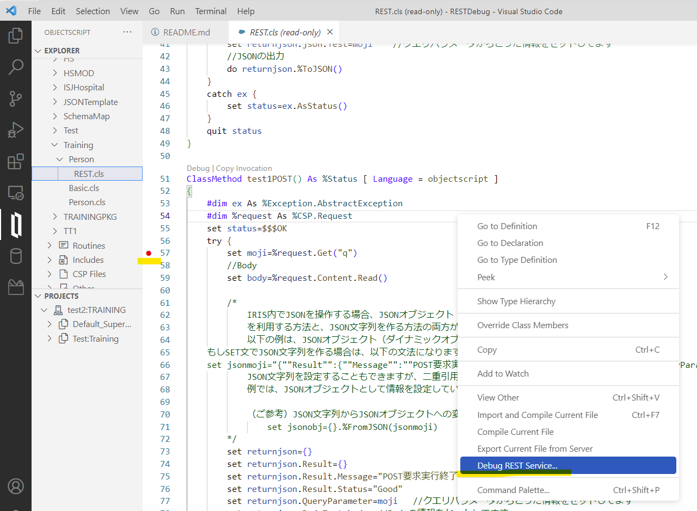
> ※ObjectScriptエクステンションの最新をご利用ください。

手順は以下の通りです。

1. デバッグ対象メソッドにブレークマークを付ける

    上の図例では、 をクリックしサーバ側コードに対してブレークマークを設定していますが、ワークスペース上のソースコードのコンパイル済クラスでもブレークマークを設定しデバッグを開始できます。

2. ソースコード上で右クリック→「Debug REST Service」を選択

3. HTTPメソッド、URLを指定
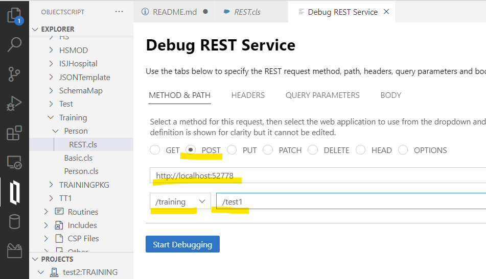

4. クエリパラメータがあれば指定「QUERY PARAMETERS」タブで指定
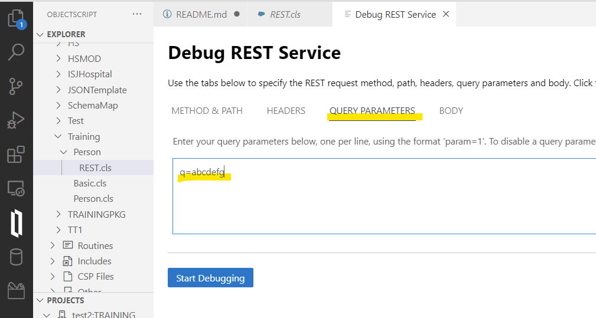

> 3.の画面のURLに ? を使用してクエリパラメータを追加できません。「QUERY PARAMETERS」をご利用ください。

5. Bodyの指定が必要であれば「BODY」タブで指定
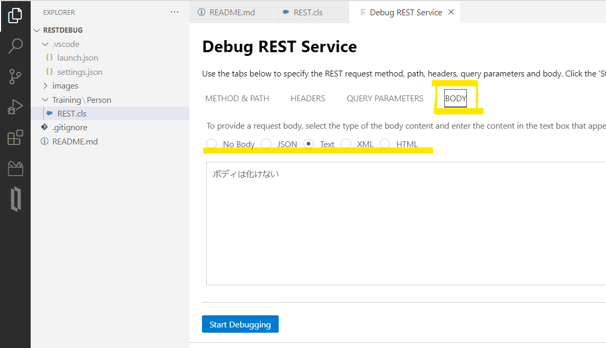

6. Start Debuggingボタンをクリックしてデバッグを開始
    
    開始後は、以下のボタンを利用してデバッグを進めます。

    デバッグ終了時は「Stop」を押して終了してください。
    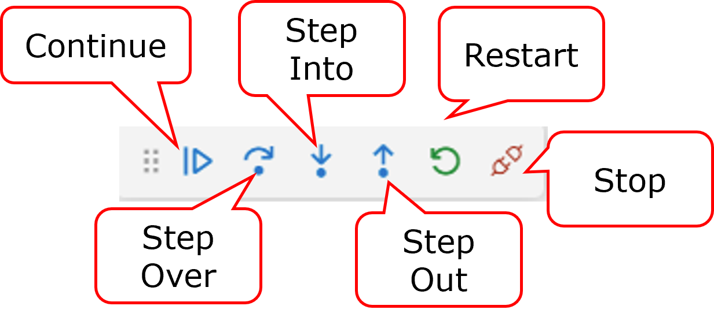


    >※　2023/2/7時点で確認できている不具合：「Debug REST Service」で実行するデバッグで、「QUERY PARAMETERS」と「BODY」に日本語を含めた場合、デバッグウィンドウの「VARIABLES（変数）」を表示するウィンドウ上の表記が文字化けします。（[問題報告中](https://github.com/intersystems-community/vscode-objectscript/issues/1078)です。例はBODYに日本語を指定した場合の例）
    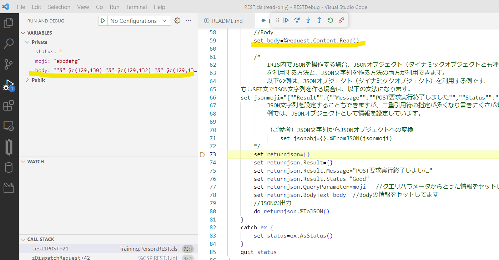
    VSCodeの「Debug REST Service」メニューではなく、RESTクライアントなどの外部クライアントから実行する場合は文字化けが起きません。方法詳細は、[2.プロセスにアタッチして実行する ](#2プロセスにアタッチして実行する)の手順をご参照ください。


### 2.プロセスにアタッチして実行する

VSCodeの「Debug REST Service」を使わずに、外部クライアント（RESTクライアントなど）からHTTP要求を実行し、処理中のIRIS内プロセスにアタッチしながらデバッグを行います。

この方法は、**HTTP要求時に実行しているIRIS内のプロセスを特定する必要があります。**

そのため、デバッグ対象のメソッドで処理を待機させるため、`hang 20`のように、hangコマンドをコード中に追加して試します。

手順は以下の通りです。

1. プロセスにアタッチしてデバッグを行うため、laungh.jsonを作成する。

    VSCodeのデバッグ用ファイル：launch.jsonファイルを作成し、アタッチ用の設定を行います。

    作成方法詳細は、[VSCode：プロセスにアタッチしてデバッグする方法](https://jp.community.intersystems.com/node/489221)の「手順1：launch.json の用意」をご参照ください。

    例）
    ```
    {
        // Use IntelliSense to learn about possible attributes.
        // Hover to view descriptions of existing attributes.
        // For more information, visit: https://go.microsoft.com/fwlink/?linkid=830387
        "version": "0.2.0",
        "configurations": [
            {
                "type": "objectscript",
                "request": "attach",
                "name": "REST-attach",
                "system": true,
                "processId": "${command:PickProcess}"
            }
        ]
    }
    ```

2. デバッグ対象メソッドにHangコマンドを利用して数秒処理を待機させる

    20~30秒待機するように記述します。

    ```
    hang 30
    ```
    VSCodeでコードを編集するためには、ワークスペース内にクラス定義用ファイルを配置する必要があります。

    サーバ側にあるコードに追記したい場合は、ワークスペースにエクスポートする必要がります。
    
    エクスポートは、サーバ側の対象コードを右クリックし「Export」を選択します。
    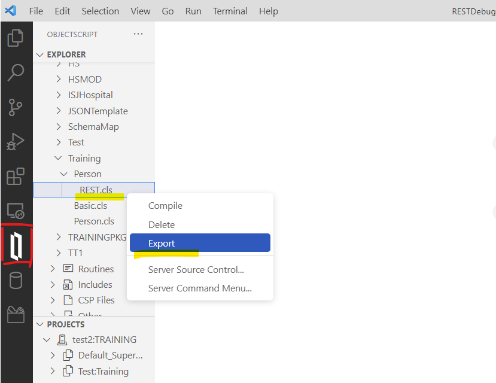
    
    Export実行後、ワークスペースに移動します。エクスポートファイルは、`/src/パッケージ名/クラス名.cls`の形式でワークスペースにエクスポートされます。
    
    対象クラスを開き、コードを追記します。

    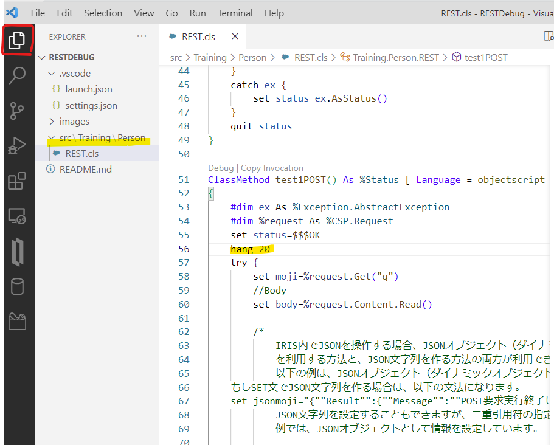
    コードの追記が終わったら、Ctrl＋Sで保存します（保存＋コンパイルが実施されます）。

3. 外部クライアントからHTTP要求を実行する

    例は、PostmanからPOST要求でクエリパラメータとBodyに文字列を指定しています。

    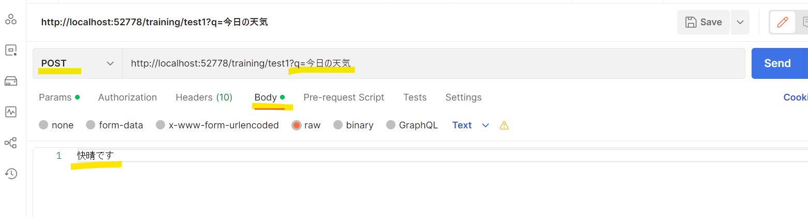

    Sendボタンを実行すると、2.で指定したHangコマンドが実行されるため、指定秒数待機します。

    この間に、アタッチ対象プロセスを探します。

4. アタッチ対象プロセスにアタッチする

    3.の実行後すぐ、VSCodeのデバッグウィンドウを開き、launch.jsonで指定したデバッグ名（例では、「REST-attach」）をクリックし、プロセスリストを表示させます。

    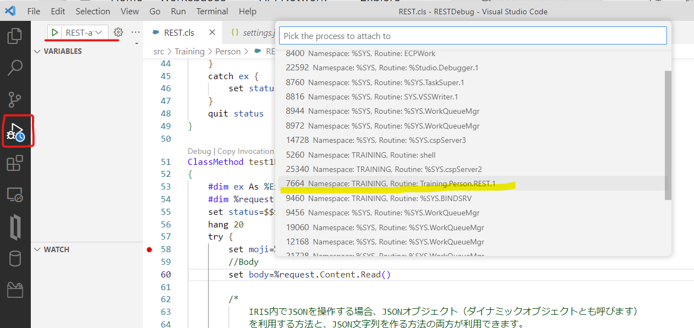

    プロセスリストには「RESTディスパッチクラス名.*」（*には数字が入ります）の形式で処理中ルーチン名が表示されます。
    
    対象プロセスを見つけたら行をクリックしプロセスにアタッチします。

    **注意：指定した`hang`の秒数の間にプロセスを見つけてアタッチしてください**

5. デバッグを実行する

    Hangコマンドの実行が終わると、ブレークマークのところでデバッグがストップします。

    後は、デバッグ用アイコンを利用してデバッグを進めるだけです。

    >アタッチのデバッグの場合、クエリパラメータやBodyに日本語が含まれていても、VARIABLES(変数)ウィンドウで正しく日本語が表示されます。

    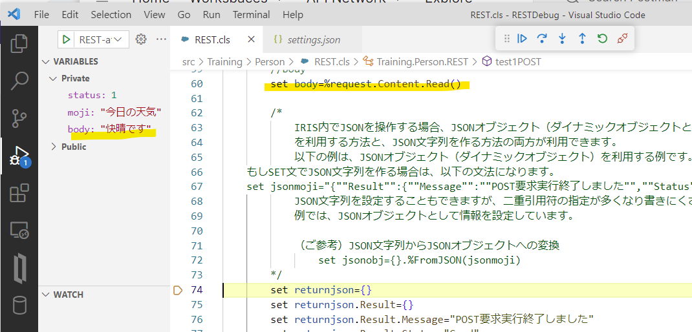

6. デバッグを終了する。
    
    最後に、デバッグ停止のボタンを押して終了します。

    


## メモ
1. アタッチ用プロセス一覧に対象プロセスが表示されない場合は、一旦VSCodeを再起動して再度お試しください。

2. アタッチのデバッグを実行するために追加した`hang`コマンドは**デバッグ終了時必ず削除／コメント化してください。**